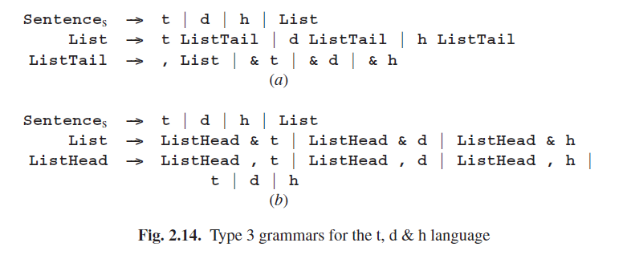
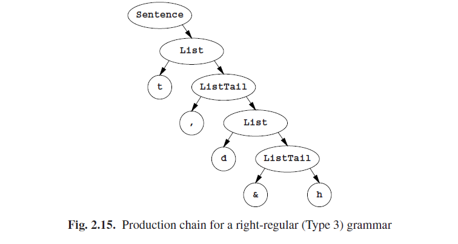

# 2.3.3 3型语法

CF语法的基本属性是它描述的是嵌套：一个对象可能在不同地方包含其他对象，这些对象又可能包含其他对象...等等。在生成过程中我们已经生成了对象中的一个，而右侧依旧“记得”接下来该生成什么：在英语语法中，在升入非终结符**Subject**之后生成类似**wistful cat**的东西，右侧的**Subject Verb Object**依然知道后面必须是一个**Verb**。当我们正在准备**Subject**时，**Verb**和**Object**已经在句子形式的右侧排队等待了，例如：

**the wistful QualifiedNoun Verb Object**

右侧是：

**up ZeroMotion down ZeroMotion**

已经执行了一个**up**和一个任意的复杂的**ZeroMotion**后，右侧依旧知道接下来是一个**down**。

对3型的限制不允许回溯以前的事情：一个右侧可能只包含一个非终结符并且其必须在结尾处。这意味着只有两种规则：[^1]

- 一个非终结符生成零个或多个终结符
- 一个非终结符生成零个或多个其后接着一个非终结符的终结符

3型语法的原始Chomsky定义对规则进行了限制：

- 一个非终结符生成一个终结符。
- 一个非终结符生成一个其后接着一个非终结符的终结符。

我们的定义是等效的并且更加方便，虽然转换为Chomsky3型并不是完全没有意义的。

3型语法也被称为*正则语法*（RE语法）或*有限状态语法*（FS语法）。以上版本的更精确定义称为*右正则*，因为规则中唯一的非终结符出现在右侧的右结尾处。这让其有别于*左正则语法*，其受到以下限制

- 一个非终结符生成零个或多个终结符
- 一个非终结符生成一个其后接着零个或多个终结符的非终结符

其规则中唯一的非终结符出现在右侧的左结尾处。左正则语法相比于右正则语法不那么直观，且不常出现，以及更难处理，但它们确实偶尔会出现（例子见5.1.1节），并且也需要加以考虑。将会在5.6节进行讨论。

由于右正则语法的普遍性高于左正则语法，“正则语法”一词通常是指“右正则语法”，左正则就需要明确指明了。本书中我们也遵照此约定。

比照右正则和右递归的定义是一件有趣的事情。非终结符A是右递归的，如果它能生成一个右侧结尾是A的句子形式；或A是右正则的，如果它能生成一个包含A的句子形式，且A在其右侧结尾处。

在对上下文无关语法的类比中，其被称为在此之后它们不能做到，正则语法应该被称为“非嵌套语法”。

因为正则语法经常被用来描述字符级的文本结构，所以正则语法的终结符号是一个单一字符是很常见的。所以我们应该用**t**代替**Tom**，**d**代替**Dick**，**h**代替**Harry**以及**&**代替**and**。图Fig 2.14（a）以这种形式展示了**t,d&h**语言的右正则语法，Fig 2.14（b）展示的是左正则语法。

3型语法（右正则）的一个句子的生成树退化为非终结符的“生成链”，该链在左侧放置了一列终结符。图Fig 2.15展示了一个例子。相似的生成链由左正则语法形成，其终结符放在左侧。

图Fig 2.14中语法展现出来的致命重复对正则语法来说很正常，然后发明了很多符号处理设备来减弱这个问题。最常用的是使用一组方括号来指出“一组字符集之外的一个”：**[tdh]**是**t|d|h**的缩写：

这个第一次看上去可能很神秘，但实际上却更方便，而且能将语法简化至：

第二种方式是引入宏，语法片段的代名词，其在被使用前被恰当的在语法中进行替代：

正则语法的流行解析生成器*lex*（Lesk and Schmidt [360]）都表现了这些便利性。

如果我们坚持3型的Chomsky定义，那我们的语法将被不会小于：

这个形式比较容易处理，但是比起*les*版本缺少用户友好性。我们在这里看正式的语言学家（formal-linguist）是否感兴趣且是否对我们有帮助通过微小的方式，计算机科学家重视语法（**$Name**, etc.）之下的概念被清楚表达的形式，虽然有需要额外处理的代价。

关于正则语法有两个有趣的观点，我们来看一下。第一个，当我们使用正则语法来生成句子，句子形式将会只包含一个非终结符并且它将总是在结尾处；如下图（使用图Fig 2.14中的语法）：

第二个观点是，所有的正则语法都可以缩减体积通过使用2.3.2节中介绍的正则表达式操作符*，+和?，来分别表达“零个或多个”，“一个或多个”以及“选择一个”。使用这些运算符和**(**以及**)**来进行分组，我们就可以将语法简化为：

**Ss ---> (( [tdh], )* [tdh]& )? [tdh]**

这里用括号来标定操作符*和?的操作数。所有3型语法都存在正则表达式。注意，*和+与它们前面的字符一起生效。为了将它们和普通的乘法和加法运算区分开，它们通常是作为上角标打印的，但是在计算机输入中它们和另外两个符号是在同一行上的，所以必须用其他方式来进行区分。

[^1]: 有一个自然的中间类型，2.5型，其中只允许一个右侧有一个单一的非终结符，不过不需要一定在结尾处。这就给了我们所谓的*线性语法*。