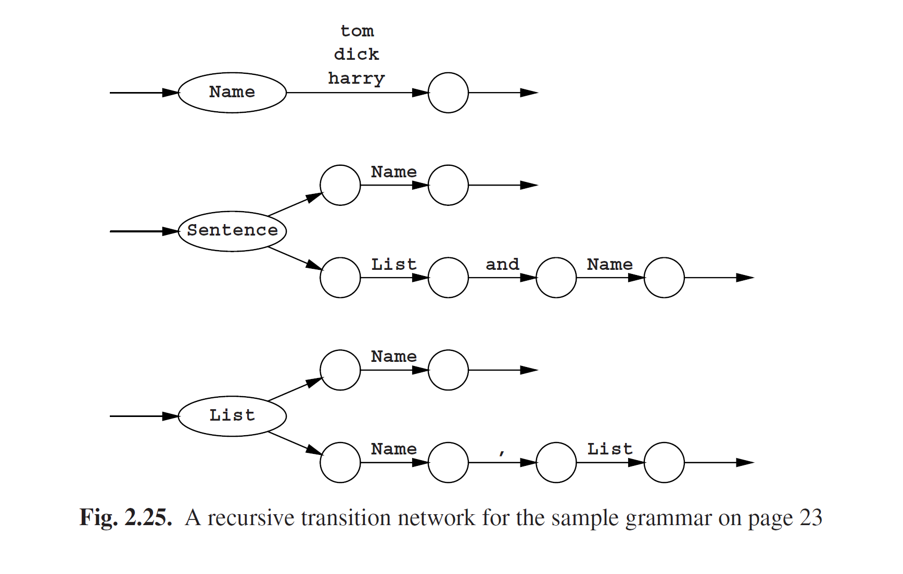

# 2.8 作为转换图的CF和FS语法

*转换图*是一个有向图，其中箭头被标记为零或你生成的一个相关联的符号，如果确实有这样的符号的话，否则就什么也不标记。节点，往往没有标记的，是符号在生成中被放置的点。如果一个节点有多个箭头向外传出，你可以选择任何一个继续往下。所以图Fig 2.24中的转换图产生相同的字符串，2.3.2节的示例语法。

把语法变成一组转换图是相当简单的，一个非终结符对应一个转换图，如图Fig 2.25。但它包含标记了非终结符的箭头，而“生成”一个非终结符的意义与箭头相关联并不是非常明确。假设我们在节点*n1*，从一个标记了非终结符的转换（箭头）*N*指向节点*n2*，而且我们想要这种转换。

我们将节点*n2*推入堆栈，而不是通过追加到输出来生成*N*，然后继续我们的进入*N*的转换图的旅程。当我们结束*N*的转换图是，我们从堆栈中弹出*n2*然后在*N2*继续向前。这就是上下文无关语法的*递归传递网络*释义：转换图组就是传递网，堆栈机制提供递归。

图Fig 2.26展示了图Fig 2.14中FS语法的右正则规则的转换图。这里我们漏掉了图终点处未标记的箭头和与其相关联的节点；我们本可以和图Fig 2.25中一样做，但这么做将会使堆栈机制变复杂。

我们看到只有当我们要离开一个非终结符的时候我们才需要在生成一个，所以我们不需要堆栈任何东西，并且能解释一个标记了非终结符*N*的箭头作为到*N*的转换图的跳转。所以一个正则语法对应于一个（非递归）传递网络。

如果我们将网络结尾处的每一个标记了*N*的箭头和*N*转换图的起始处相关联，那我们可以忽略掉非终结符，然后获得相关语言的一个转换图。当我们将这个短路劲应用在图Fig 2.26的传递网络，并稍微重新排列一下节点，我们就得到了图Fig 2.24的转换图。
