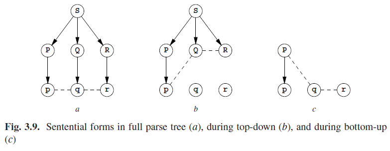

# 3.5.3 一般定向方法

解析就是重建生成过程这个观点，当使用定向方法时就尤为明显。它概述在以下两点中：

- 一个定向的自顶向下（从左到右）的CF解析器，标识生成过程中最左侧的产物。

并且

- 一个定向的自底向上（从左到右）的CF解析器，标识反向生成过程中最右侧的产物。

我们用一个非常简单的语法来证明这个：

这个语法只生成唯一的字符串， **pqr** 。

**pqr** 最左侧的产物的生成过程如下：

其中|标识生成过程进行到哪儿了。自顶向下过程通过首先确定生成 **p** 的规则来模仿这一过程，**P--->p** ，接下来是 **q** ，等等：

**pqr** 的最右侧的生成过程如下：

同样|标识生成过程进行到哪儿了。自底向上分析回滚了这一过程。要做到这一点，必须要先确定步骤4的规则，**P--->p**，并将它作为还原，然后是第3步，**Q--->q**，等等。幸运的是解析器可以很容易做到这点，因为最右侧的生成产物成为了已生成和未生成的句子部分的分界，所以最后的产物是结果的最左侧，正如我们前边看到的。然后解析过程就可以从那儿开始了：

这种双重逆转是定向自底向上解析所固有的。

解析树的构建和句子形式的关联如图Fig 3.9所示，其中虚线表示句子形式。左侧我们有一个完整的解析树；对应的句子形式就是终结符的字符串。中间的图展示了在一个自顶向下解析器中的部分解析树，在 **p** 生成之后。对应这种情况的句子形式就是 **pQR** 。它起因于两种生成过程 **S** $$\Rightarrow$$ **PQR** $$\Rightarrow$$ **pQR**，这产生了解析树。右图表示了在自底向上解析器中 **p** 被生成后的部分解析树。对应的句子形式是 **Pqr** ，由 **pqr** $$\Leftarrow$$ **Pqr** 产生；唯一的还原结果导致了只有一个节点的解析树。

将广度优先或深度优先与自顶向下或自底向上结合起来，就得到了四种级别的解析技术。自顶向下技术将在第6章介绍。深度优先自顶向下技术带来了一个非常简单的实现，叫做递归降序；这种技术将在6.6节介绍，非常适合手工编写解析器。由于深度优先搜索内置于Prolog语言中，对这种语言的大量语法的递归降序解析就可以非常简单的定制，使用一个被称为“Definite Clause Grammars”（6.7节）。这项技术的适用性可以扩展到所有语法通过使用一种叫做“cancellation”(6.8 节) 装置。

自底向上技术将在第7章介绍。广度优先和自底向上的结合带来了Earley解析器，对CF语法来说其中有一些非常有效和流行的解析器（7.2节）。一个正式的相似但执行却非常不同的方法带来了“图标解析”（7.3节）。

Sudkamp [397, Chapter 4]给出了一个完全正式的解释，关于[ 广度优先|深度优先 ][ 自顶向下|自底向上 ]上下文无关解析。