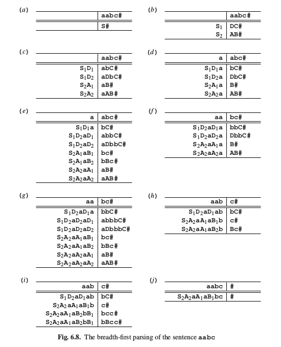

# 6.3.1 一个例子

图6.8展示了对句子**aabc**的一个完整的广度优先解析过程。最开始只有一个预测栈：它包含开始符号和终止记号;没有符号被接受（*框架a*）。得到 *（b）*的步骤是一个预测步骤;有两个可能的右侧，所以我们得到两个预测栈。预测栈的不同也表现在了分析栈上，**S**的不同后缀代表不同的右侧选择。下一个有多种右侧的预测步骤得到了（*c*）。现在所有预测栈栈顶都是终结符;刚好都成功匹配，这就得到（*d*）。接下来，有些预测开头又是非终结符了，所以进行下一个预测步骤得到（*e*）。在下一个步骤是匹配步骤，幸运的是，有些匹配失败了，因此这些会被去掉，因为由它们不可能得到成功的解析。从（*f*）到（*g*）又是一个预测步骤。另一个有一些失败匹配的匹配步骤让我们得到（*h*）。在接下来的一个预测步骤会带来（*i*），然后在接着一个匹配步骤最终给我们带来（*j*），终止记号匹配，解析成功。

最终的解析（analysis）是

**S2A2aA1aB1bc#**

目前，我们不需要解析里的终结符;把它们去掉之后就得到

**S2A2A1B1**

这说明我们通过先应用规则**S2**，再用**A2**等等一系列规则后，得到最左推导，每次替代掉最左的非终结符。检查一下：

**S&rarr;AB&rarr;aAB&rarr;aaB&rarr;aabc**

这里描述的广度优先最初出现在Greibach [7]。但是，在那个论文中，语法被转化为了Greibach范式，并且使用的步骤跟我们最开始的下推自动机的相似。所以预测和匹配步骤被结合起来了。