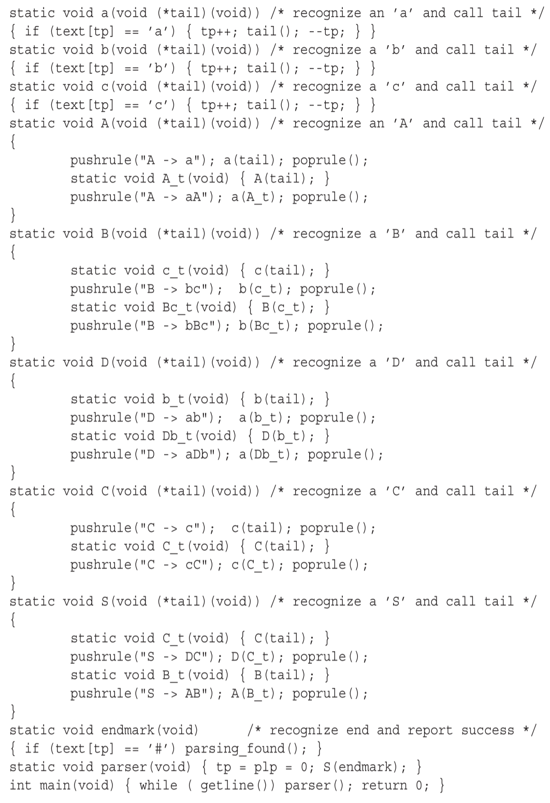

# 6.6.3 Breadth-First Recursive Descent

Johnstone and Scott [36] present a different approach to exhaustive recursive descent, called Generalized Recursive Descent Parsing (GRDP). Like the naive approach of Section 6.6.1 it features a separate parsing procedure for each non-terminal. However, instead of returning as soon as a match is found, which was the pitfall causing the naive approach to fail, the GRDP procedure for a non-terminal A keeps track of all matches, and in the end returns the set of lengths of input segments that start at the current position and match A. The returned set can be empty, in which case no
match was found.

The caller of such a procedure, which presumably is processing a right-hand-side in which A occurs, must be prepared for this and process each of the lengths in turn when trying to match the rest of this right-hand-side. In the end, the caller of the procedure for the start symbol should check that the length of the input is a member of the returned set.

Given the grammar

**SS --->A a b**

**A--->a A a | ε**

and the input string aaaaaaab,thecallin S to the routine for A will return the lengths 0, 2, 4, and 6, and only for length 6 will the routine for S be able to parse the remaining ab. The events inside the routine for A are more complex. After matching the first a, the routine calls itself, yielding the lengths 0, 2, 4, and 6. It tries these lengths and for each length it tries to match the final a; this succeeds for 0, 2, and 4, but not for 6. Together with the two matched as this yields the lengths 2, 4, and 6. The alternative A--->ε supplies the length 0, resulting in the length set { 0, 2, 4, 6 } as
returned to S.

The fact that each procedure returns all possible matches prompted us to call this method breadth-first, although the method also has a depth-first aspect, in that each right-hand-side of a non-terminal is examined in-depth before the next right-hand-
side is examined.

The method is suitable for all non-left-recursive CF grammars and can be optimized to perform competitively with common-place parser generators for LL(1) grammars or non-left-recursive LR(1) grammars. The method is implemented in a freely available parser generator; see Johnstone and Scott [363].