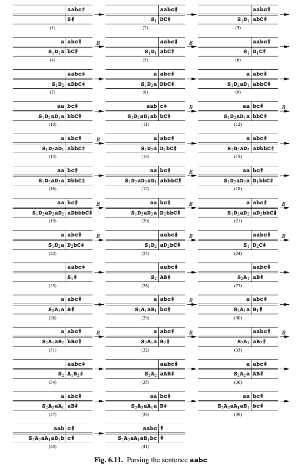

# 6.6 递归下降

在前面的小节里，我们已经见过了几种自动机的工作，在处理输入句子时用语法决定解析的步骤。现在有另一种方式的说明：这些自动机将语法作为程序。将一个语法看作解析器的一个程序并不像看起来那么牵强。毕竟，一个语法是推导其所描述的语言的句子的说明，我们在自顶向下解析中做的就是从一个语法重新推导一个句子。这跟将语法看作生成装置的传统观点的差别仅在于我们现在在尝试重推导一个特定的句子，而不是任意句子。以这种方式看，语法就是程序，以一种描述性的编程语言写成——就是说，这种语言定义结果而不是获得结果需要进行的步骤。

如果想为一个给定的上下文无关语法写一个自顶向下解析器，我们有两种选择。第一种是按照前几节里描述的自动机写一个程序。这个程序可以以一个语法和一个句子为输入。这听起来很完美，而且易于实现。但是当需要解析器在识别了部分输入的同时在做些别的操作的时候，就有些问题了。比如，当处理一个声明序列时，编译器须要生成符号表。基于此以及效率的考量，于是就有了第二个选项：对给定语法写一个专用的解析器。有很多这样的专用解析器，其中的大多数都用了一个叫做*递归下降*的实现技术。我们将假设读者具有一定的编程经验，对程序和递归有所了解。如果完全没有基础，这一节可以跳过。本节没有描述新的解析方法，只描述了一个实现的技术，它常用于手写解析器和一些机器生成的解析器。
