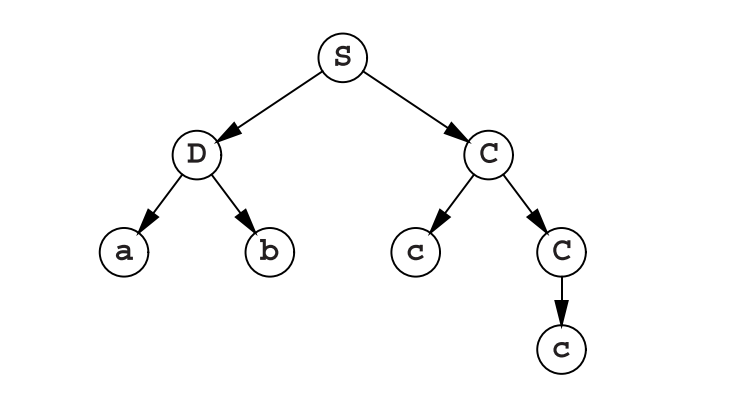

# 6.7.4 Running Definite Clause Grammar Programs

The DCG program of Figure 6.16 can be loaded into a Prolog interpreter, after which we can submit queries as described above. In composing these queries we should be aware that the root of the grammar, S, corresponds to a DCG name s_n(T) where T is the parse tree and to a Prolog predicate s_n(T,S,R) where S is the sentence and R is the remainder. The runs presented here were performed on C-Prolog version 1.5.

First we want the DCG program to generate some sentences, together with their parse trees. We do so by passing two uninstantiated variables, S and T,to s_n,and requesting the system to find three instantiations (user input has been underlined to differentiate it from computer output):

We see that the system will only generate sentences S starting with an a followedbya b, and then followed by an ever increasing number of cs. The Prolog system uses a depth-first search mechanism, which is not suitable for sentence generation (see Section 2.4, where we use a breadth-first method). The values of T show the corresponding parse trees; each has the rule S--->DC as the top, and the components describe its two children. It is important to note that S--->DC is used here as a name, so S--->DC(D--->ab,C--->cC(C--->c)) should be read as ’S->DC’(’D->ab’,’C->cC’(’C->c’)), which corresponds to the parse tree

Next we ask the system to recognize some sentences; we start with our example from Section 6.6.1, abc:

The full backtracking parser correctly parses the string but also supplies a second parsing, missed by the naive backtracking parser. The third answer, no, indicates that no further parsings are possible. 

Finally we try the two input strings on which the naive parser of Section 6.6.1 failed, aabc and abcc:

Both input strings are handled correctly. They indeed involve applications of both A--->a and A--->aA in the first and of both C--->c and C--->cC in the second example.

These runs demonstrates that we can use Definite Clause Grammars quite well for recognizing sentences, and to a lesser extent also for generating sentences.

Cohen and Hickey [26] discuss this and other applications of Prolog in parsers in more detail.