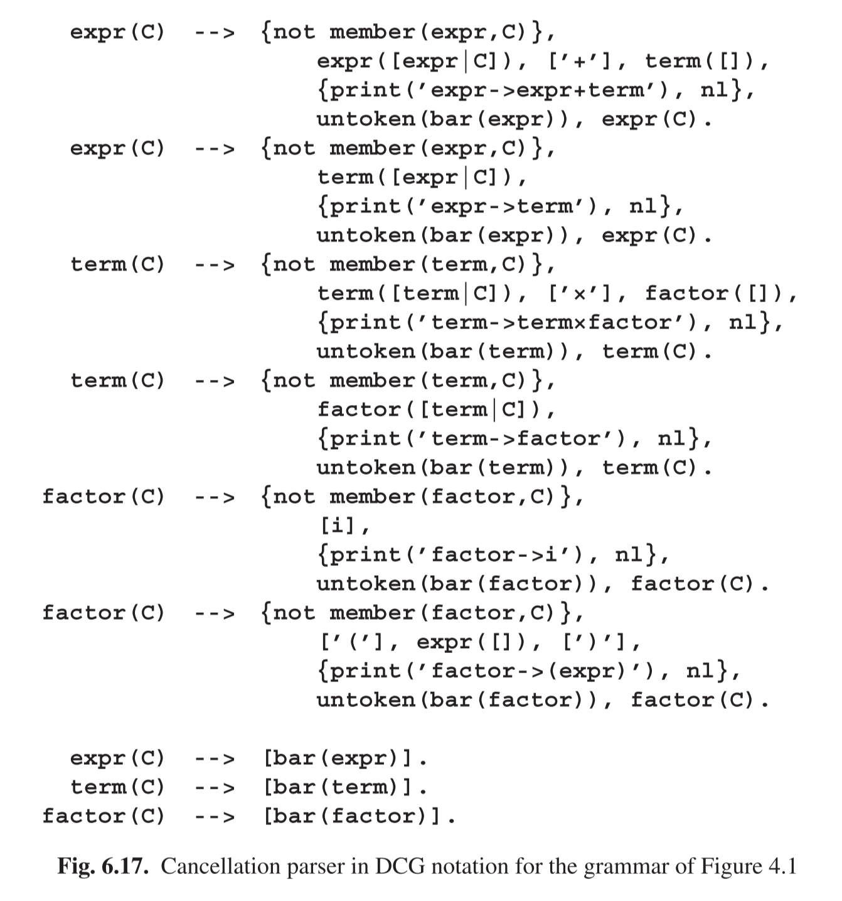

# 6.8.2 转换方案

我们假设Prolog DCG系统有可能通过将DCG规则放入一对大括号来把它和“正常”Prolog文本穿插在一起，并且当 **member(E,L)**中**E**是**L**的元素时底层Prolog系统可以成功定义**E**。非终结符A到一组DCG取消规则的转换方案由三个部分组成，一个是用于*A → Bα*形式的规则，一个是用于*A → tα*形式的规则，以及一个用于处理*$$\overline{A}$$*的特定规则：

此时，我们假设*α*不为空；*A → ε*的并发形式我们下一节再讨论。

这个转换方案包含了很多微妙之处。逻辑参数C是取消集，并且目标**not member(A,C)**暗含了A是否属于取消集的测试。右手侧的转换遵循第6.7.2节中所示的CF-DCG转换，除非所有非终结符都将取消集作为参数。如果右手侧以一个非终结符作为开头，则该非终结符会有一个与*A*扩展所得的一样的取消集；而其他非终结符都会得到空的取消集。

DCG形式的**untoken(bar(A))**将*$$\overline{A}$$*的一个副本推回输入流。它的工作原理如下：Prolog谓词**untoken**定义如下：

**untoken(T,S,[T| S]).**

DCG处理器会将DCG应用程序**untoken(a)**开发成Prolog式的**untoken(a,Sentence,Remainder)**。因此调用**untoken(a,Sentence,Remainder)**将会给 **[a| Sentence]**设置**Remainder**，因此在输入的其余部分的前面加上**a**。

在*A(C)*的模式这点上我们已经识别了一个*Bα*或*tα*，并将其简化为*$$\overline{A}$$*后推回；因此就输入而言我们没有取得任何进展，反而依然有一个A需要解析，但这就是调用方所想要的。这个解析过程必须能从输入中获取*$$\overline{A}$$*并将其合并到解析树中。*$$\overline{A}$$*有两个备选项：*A* 的左递归规则以及 ***A(C)***的调用者。第一种情况下，将在左支构建一个新的*A*节点；在第二种情况下，*A*节点的左支就在此处结束。Prolog系统必须同时考虑到这两种情况。这可以通过引入*Ax*（通过*A*的所有左递归规则和 *$$\overline{A}$$* 来定义）来实现。 此外，为了允许激活新的做递归规则，必须在不显示调用*A*的情况下调用*Ax*。所以我们现在的转换方案是：

其中 *Al*代表 *A*的所有左递归规则，以及 *An*代表*A*的所有非左递归规则。

只要输入前面有一个 *$$\overline{A}$$* ，唯一可以往下进展的规则就是可以吸收 *$$\overline{A}$$* 的那些规则。其中之一是 ***Ax(c)-->Al(c)*** ，另一个则是第一种模式下的 *B*。这个*B*通常与*A*相等，但如果*A*是间接左递归那么则不一定是相等的；在这种情况下，对*B*的调用实际上是调用*Al*。如果*B*等于*A*，则它在转换过程中的替换必须能够吸收 *$$\overline{A}$$*，且必须能继续解析*A*的非左递归实例。所以我们还需要一个*Ab*，定义如下：

一开始围绕在我们周围的谜团可以通过一个简单的观察来解决：我们可以将*A*的非左递归规则加到 *A*中，而左递归规则加到*Ab*中，两者都不会影响解析器工作，原因如下。*A*的非左递归规则永远都不能吸收 *$$\overline{A}$$*，因此将它们加到*Ax*中最多导致调用失败；并且对*A*的左递归规则的调用将会被*Ab*的左递归检查堵塞。因此*Ax*和*Ab*都变成了*At*，定义如下：

除了简化转换方案外，这还解决了确定哪些规则是左递归规则的需要。

简化后的转换只留下了*A*和 *At*，其中*As*只能出现在右手侧的非第一个位置。在这些位置，*As*都可以用*Ats*替换而没有任何影响，因为唯一的区别是*At*可以接受 *$$\overline{A}$$*，而 *$$\overline{A}$$s*不会自行出现在输入中。所以最终在转换模式中只留下了*Ats*，这意味着可以重命名为*A*。这就回到了本节开头的转换方案。

图Fig 6.17展示了图Fig4.1的简单数学表达式语法的结果取消解析器。注意：

**expr([expr|C]), [’+’], term([]),**，第一个**expr**是代表DCG，第二个**expr**只是一个常量，用来添加到取消集中。

我们不是在逻辑变量中构建解析树，而是使用**print**语句来生成它；由于这些被放置在识别的末尾，因此解析树是按自底向上的方向生成的。使用查询 **expr([],[i,’×’,i,’+’,i,’×’,i],[])** 运行此DCG取消解析器会产生以下反向最右派生：

