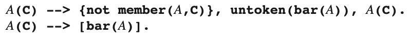
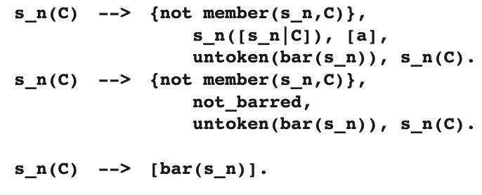

# 6.8.3 使用 ε 规则进行取消解析

首先识别左侧-右侧子树，这在我们的算法中引入了自底向上的组件。 我们知道，自底向上的技术可能会与 ε 规则产生问题。 事实上，对于规则 A → ε 的简单转换，

会导致大量的 bar(A) 标记被插入到输入流中，从而产生无限循环。 如我们在 3.4.3.2 节中所述，一个自底向上的解析器“会不断地找到遍布输入流中的空产生式”。

这种失败的技术原因在于，上述简化操作不适用于 ε 规则。 ε 规则是一种非左递归规则，尽管它不能吸收 Ā，但仍然可以成功，从而为 Ā 提供在输入中保留的方式。 这直接表明一种解决方案：在已经存在 bar 标记作为剩余输入的第一标记时，阻止识别空产生式。 为了检查此条件，我们需要一个谓词 `not_barred`，其 Prolog 形式可以定义为：

`not_barred(S, S) :- not(S = [bar(X)|T])。`

它在 S 可以分解为某个 bar 头部 X 和某个尾部 T 时失败；请注意，X 和 T 的最终值并不重要。

以下 DCG 取消解析器将此技术应用于语法 S → Sa|ε：

